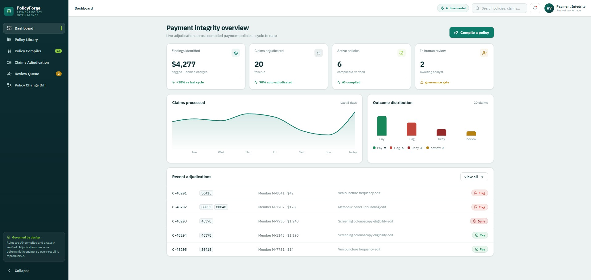
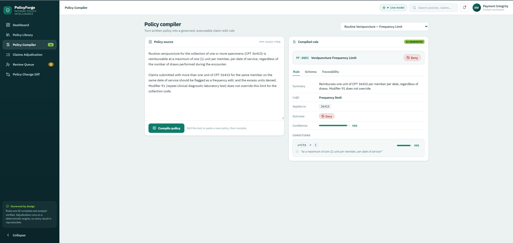
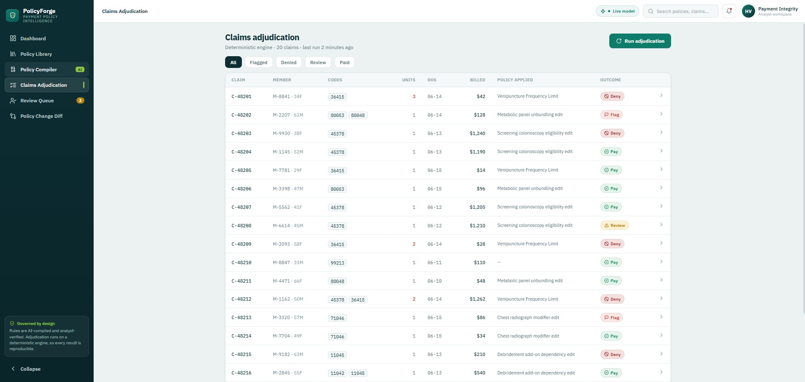
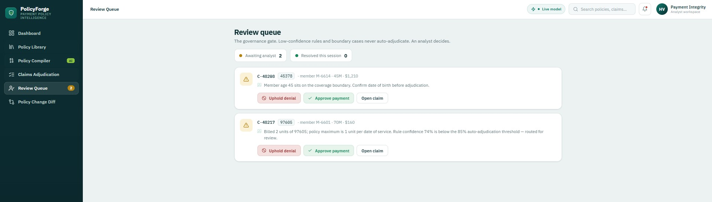
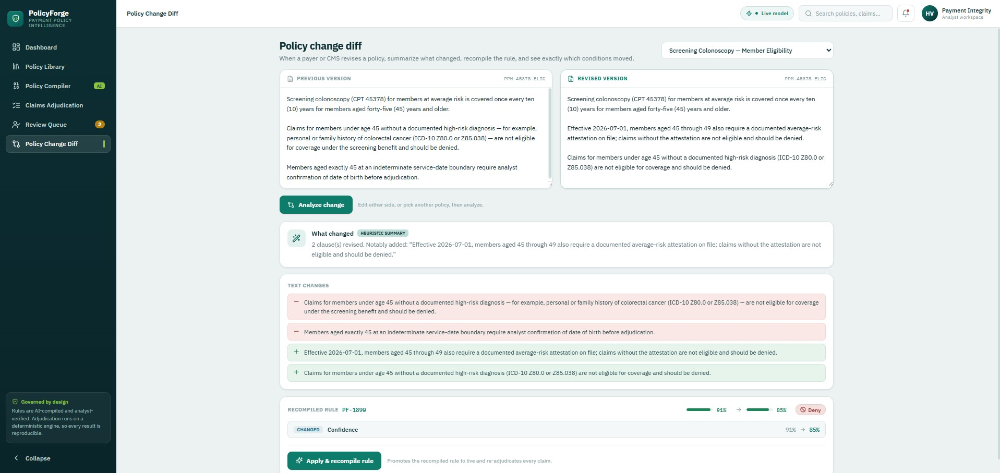

# PolicyForge

**Governed GenAI policy to rule compilation for healthcare payment integrity.**

PolicyForge reads a written payment or coding policy, compiles it into a transparent
executable claim edit rule, and runs claims against that rule. Every claim is paid,
flagged, or denied with a plain English reason and a citation back to the exact policy
clause that drove the decision. Low confidence rules and boundary cases never adjudicate
on their own. They route to a human review queue where an analyst makes the call.

It is a concept demonstrator built around a single thesis:

> **The model authors rules. A deterministic engine applies them.**
> That separation is what makes every adjudication reproducible, auditable, and safe to
> put in front of a clinician, which is the reason claim adjudication does not run on the LLM.

---

## Feature walkthrough

A tour of the product, one screen at a time. The interface is built as a real enterprise
application rather than a sidebar demo, with a Cotiviti family teal and ink palette and an
IBM Plex type system.

### Dashboard



The operations view. It opens like a product already in production, surfacing the headline
numbers a payment integrity team watches: findings identified, the share of claims that
auto adjudicated, total claims processed, and how many sit in the human review queue. It is
the at a glance proof that the compile, apply, and govern loop is running end to end.

### Policy Compiler



The heart of the product. Pick a written policy on the left, hit Compile policy, and the
model returns a typed, executable rule on the right: a logic type, the target codes, the
conditions that fire, an outcome, and a self scored confidence. Every condition carries the
verbatim phrase from the policy that justifies it. The Traceability tab highlights each
condition back in the original text, so an analyst can audit the rule against its source
before it touches a single claim. The badge in the top bar reports whether the live model or
the heuristic fallback authored the rule, so nothing is ever faked.

### Claims Adjudication



The deterministic engine at work. Run adjudication and every claim is paid, flagged, or
denied against the current rules. Because a plain Python engine does the deciding, the same
claim always produces the same result. Open any claim to see the firing condition, the cited
policy clause, and the rule confidence, then export the determination as auditable JSON.

### Review Queue



The governance gate made visible. Boundary cases and any finding from a rule whose confidence
sits below 0.85 land here instead of adjudicating on their own. Two claims demonstrate the two
distinct routes to review: an age 45 boundary case, and a claim that trips a real edit but
whose rule confidence is below the gate. The analyst approves or upholds each one.

### Policy Change Diff



Maintenance made literal. Paste a revised version of a policy and the system summarizes what
materially changed, recompiles the rule, and shows a clause by clause before and after. Apply
a tightened revision of a vague policy and watch its confidence cross the gate, at which point
its findings stop routing to review and begin adjudicating automatically.

---

## The problem this addresses

Payment integrity is the work of making sure a health plan pays each claim correctly
against a large body of clinical and billing rules. It is a multi billion dollar discipline,
and the rules that power it are still written and maintained largely by hand.

Cotiviti is the dominant payment integrity vendor in this space, serving more than 100
payers including 23 of the top 25 health plans, and its flagship product, Payment Policy
Management, helps payers tailor, test, and execute clinical and payment policies so that
incorrect payments are averted. Applying a policy to a claim with a rule engine is mature
and solved. The expensive, slow, still manual step is **authoring** the rule from the
written policy in the first place.

Cotiviti has said publicly that it is exploring how generative AI can help improve the
process of maintaining payment policies and aid the exploration of new ones. PolicyForge
prototypes exactly that missing layer. It is an assistant that drafts the rule and routes
every uncertainty to an expert, rather than an AI that decides on its own.

This framing matters for a reason that is easy to miss. The hand built rule library is the
moat. So the goal is not to automate the rule writers away. The goal is a copilot for expert
authors: GenAI drafts the rule, the clinician approves it, and every rule traces back to its
policy clause. That turns a commoditization threat into a speed advantage for the people who
already own the work.

---

## Where this sits in the market

It helps to be precise about novelty, because the claim is not that nobody has touched this.

* **Mature and solved.** Rule engines that apply policy to claims are decades old. This is
  Cotiviti's core product. PolicyForge does not reinvent it. It reuses the idea as the
  deterministic apply step.
* **Emerging and crowded.** LLMs interpreting policy and reasoning over claims is active, but
  mostly on the provider and revenue cycle side, aimed at preventing denials before they happen.
* **Still open.** Generative AI that authors and maintains the executable rule from policy
  text, on the payer side, with full traceability and a human in the loop, is not a shipped,
  commoditized product. That is the gap PolicyForge demonstrates, and it is the gap Cotiviti
  has named as something it is exploring.

The honest positioning is "frontier but validated," not "never been done." The approach is
proven enough to be safe to build, and the governed payer side version is still white space.

---

## What PolicyForge does

* **Compiles policy into a typed rule.** Paste a written payment or coding policy and the
  compiler emits a single structured rule: a logic type, the target CPT codes, the conditions
  that fire, any exceptions, an outcome, and a self scored confidence. Every condition carries
  the verbatim phrase from the policy that justifies it.
* **Adjudicates claims deterministically.** A plain Python engine runs the compiled rule over
  a set of claims and returns pay, flag, or deny for each one, with the firing condition and
  the cited clause attached.
* **Summarizes and diffs policy change.** Paste a revised version of a policy and the system
  summarizes what materially changed, recompiles the rule, and shows a clause by clause before
  and after. This makes the "summarization and comparison of content changes" idea literal.
* **Governs every decision.** Boundary cases and any finding from a rule whose confidence sits
  below 0.85 route to a human review queue instead of adjudicating automatically.
* **Runs with no secrets.** With no API key, the compiler falls back to a deterministic,
  first principles heuristic extractor, so the whole compile, adjudicate, govern loop works on
  a fresh clone. Add a Groq key and it compiles with a live model instead. The interface labels
  which mode is active. Nothing is faked.
* **Has a tested core.** A pytest suite pins the deterministic engine and the heuristic
  compiler, including a reproducibility property test, which is the claim that makes the output
  auditable.

---

## A worked example

Take a real style frequency policy for routine venipuncture:

> Routine venipuncture for the collection of one or more specimens (CPT 36415) is reimbursable
> at a maximum of one (1) unit per member, per date of service, regardless of the number of
> draws performed during the encounter. Claims submitted with more than one unit of CPT 36415
> for the same member on the same date of service should be flagged as a frequency edit, and
> the excess units denied. Modifier 91 does not override this limit for the collection code.

Hit **Compile policy** and the model returns a typed rule:

| Field | Value |
| ----- | ----- |
| Rule | PF-0001, Venipuncture Frequency Limit |
| Logic | Frequency limit |
| Applies to | 36415 |
| Condition | `units > 1` |
| Citation | "at a maximum of one (1) unit per member, per date of service" |
| Outcome | Deny |
| Confidence | 100 percent |

Now run claims against it. A claim billing one unit of 36415 pays. A claim billing three units
on the same date for the same member denies, and the determination shows the firing condition
(`units > 1`) and the exact sentence it came from. The model read a firm numeric cap, attached
the phrase that proves it, and chose the deny outcome the policy mandates. From that point on,
the same input always produces the same output, because a deterministic engine, not the model,
is doing the adjudication.

---

## The five edit types it covers

The six seed policies span five distinct payment integrity logic types, so the demonstrator
exercises every adjudication path rather than one happy case.

| Logic type | What it tests | Example |
| ---------- | ------------- | ------- |
| Frequency limit | A per date unit cap | CPT 36415 capped at one unit per member per date |
| Mutually exclusive | An NCCI component pair billed together when only the comprehensive code is payable | An unbundled lab panel billed alongside its components |
| Eligibility | An age or coverage criterion | A screening payable only at or above a member age |
| Modifier required | A code that must carry a specific modifier to be payable | A procedure that must carry an anatomical or distinct service modifier |
| Add on code | A secondary code payable only alongside a primary procedure | An add on code billed with no qualifying primary code present |

The 20 synthetic claims are engineered to land on every outcome, including the two distinct
ways a finding can route to governance: an age 45 boundary case, and a finding produced by a
rule whose confidence falls below the gate.

---

## Architecture

```
   Written policy
        |
        v
   +--------------+   Groq model (server side)     +----------------------------+
   |   COMPILE    | ------------------------------>|  Rule (typed JSON)          |
   |  services/llm|   verbatim source_quotes       |  conditions + confidence    |
   +--------------+   + self scored confidence      |  + exceptions + outcome     |
                                                    +--------------+--------------+
                                                                   |
   Claims --------------------------------------------------->     |
                                                                   v
                                            +------------------------------+
                                            |   APPLY (deterministic)       |
                                            |   services/adjudication.py    |
                                            |   same in produces same out   |
                                            +--------------+----------------+
                                                           v
                                            confidence at or above 0.85 ?
                                              |                  |
                                             yes                 no
                                              v                  v
                                      Auto adjudicate      Human review queue
                                    (pay / flag / deny)     (analyst decides)
```

The compiled `Rule` is the single contract both sides speak. The model emits it, the engine
consumes it, the interface renders it. Strong typing on that object means an ambiguous policy
can never silently produce an unrunnable rule. It surfaces for review instead.

The compile step uses whichever compiler is available. It is the Groq hosted model when a key
is set, and the deterministic heuristic extractor otherwise, which also acts as a safety net if
a live call fails. Both emit the same `Rule`, so everything downstream is identical. Only the
authoring changes, never the adjudication.

---

## The governance gate

Two seed claims demonstrate the two ways a finding routes to a human instead of adjudicating
on its own.

* **Boundary case.** A screening eligibility rule keys on member age. A claim at exactly age
  45, sitting on the threshold, is held back from an automatic decision and routed to review,
  because a boundary is precisely where a confident automatic answer is most dangerous.
* **Low confidence rule.** A vaguely worded policy compiles to a rule with confidence around
  0.74, below the 0.85 gate. Even though the finding trips a real edit, it does not adjudicate
  on its own. It waits for an analyst.

In the policy change view you can watch this resolve. Apply a tightened revision of the vague
policy and its confidence crosses the gate, at which point its findings stop routing to review
and begin adjudicating automatically. That is the governance story made tangible: confidence is
not decoration, it changes what the system is allowed to do without a human.

---

## Tech stack

| Layer    | Choice |
| -------- | ------ |
| Backend  | FastAPI, Pydantic v2, Groq Python SDK |
| Compiler | Groq hosted Llama 3.3 70B by default, structured JSON generation |
| Fallback | Dependency free heuristic extractor (regex plus keyword scoring) |
| Engine   | Plain, branch by branch Python, deterministic and auditable |
| Tests    | pytest, covering engine outcome paths, reproducibility, and the heuristic compiler |
| Frontend | React 18, Vite, TypeScript, Recharts, lucide-react |
| Design   | IBM Plex Sans and Mono, a Cotiviti family teal and ink palette |

The model only authors. The deterministic engine, the typed schema, and the review gate are
what make the output safe to act on.

---

## Project structure

```
policyforge/
|-- backend/
|   |-- app/
|   |   |-- main.py                 # FastAPI app, CORS, bootstrap and health
|   |   |-- config.py               # settings, reads GROQ_API_KEY (stays server side)
|   |   |-- schemas.py              # Pydantic domain models, the Rule contract
|   |   |-- store.py                # in memory repository (seam for a real database)
|   |   |-- data.py                 # seed policies, rules, synthetic claims
|   |   |-- services/
|   |   |   |-- compiler.py         # orchestrator, live vs heuristic plus policy diff
|   |   |   |-- llm.py              # policy to Rule compiler (Groq)
|   |   |   |-- heuristic.py        # offline, deterministic fallback extractor
|   |   |   |-- adjudication.py     # the deterministic engine and governance gate
|   |   |-- routers/                # policies, compiler, claims, review
|   |-- tests/                      # pytest, engine, heuristic, and API contract
|   |-- requirements.txt
|   |-- Dockerfile
|-- frontend/
|   |-- src/
|   |   |-- App.tsx                 # shell, bootstraps data, holds state, routes views
|   |   |-- theme.ts                # design tokens and outcome system
|   |   |-- types.ts                # domain types that mirror the backend schema
|   |   |-- api/client.ts           # the only place that talks to the backend
|   |   |-- components/ui.tsx       # Badge, Confidence, Sidebar, TopBar primitives
|   |   |-- views/                  # Dashboard, PolicyLibrary, Compiler, Claims,
|   |   |                           #   ReviewQueue, PolicyDiff, ClaimDrawer
|   |-- package.json
|   |-- Dockerfile
|-- docker-compose.yml
|-- README.md
```

---

## Quickstart

You need Python 3.11, 3.12, or 3.13 (not 3.14, which the pinned dependencies cannot build yet)
and Node 18 or newer. A Groq API key is optional. Without one the compiler runs in heuristic
mode and the app still works end to end. A free key is available at
[console.groq.com/keys](https://console.groq.com/keys).

### 1. Backend

```bash
cd backend
python -m venv .venv && source .venv/bin/activate      # Windows: .venv\Scripts\activate
pip install -r requirements.txt
cp .env.example .env                                    # optional, paste a Groq key for the live model
uvicorn app.main:app --reload                           # http://localhost:8000
```

Paste your key into `backend/.env`:

```
GROQ_API_KEY=gsk_your_real_key
GROQ_MODEL=llama-3.3-70b-versatile
```

Interactive API docs live at `http://localhost:8000/docs`. Run the tests from `backend/` with:

```bash
pytest
```

### 2. Frontend

```bash
cd frontend
npm install
npm run dev                                             # http://localhost:5173
```

The Vite dev server proxies `/api` to the backend, so no extra config is needed.

### Or run both with Docker

```bash
docker compose up --build                               # zero config, heuristic mode
# or, for the live Groq compiler:
GROQ_API_KEY=gsk_... docker compose up --build
# frontend at http://localhost:5173   backend at http://localhost:8000
```

### Confirm which compiler is live

Open `http://localhost:8000/api/health`. With a valid key you will see `"compiler_mode":
"live"` and the model name. With no key it reports `"heuristic"` and the app still runs the
full loop. The badge in the top bar of the interface reports the same thing.

---

## Demo flow

1. **Dashboard.** Opens like a product already in production: findings identified, the
   automatic adjudication rate, and claims processed.
2. **Policy Compiler.** Pick a policy and hit Compile policy. The model returns a structured
   rule with confidence bars and source quote citations. The Traceability tab highlights each
   condition back in the original text. Paste a brand new policy and recompile to prove it is
   live, not canned.
3. **Claims Adjudication.** Hit Run adjudication. The deterministic engine flags, denies, or
   pays each claim. Open one to see the firing condition and the cited clause, and export the
   determination as auditable JSON.
4. **Review Queue.** Two claims sit here: the age 45 boundary case, and a claim that trips a
   real edit but whose rule confidence (74 percent) is below the gate. Approve or uphold each
   as the analyst.
5. **Policy Change Diff.** Pick a policy, edit the revised pane, and hit Analyze change. The
   system summarizes what changed, recompiles the rule, and shows the clause level before and
   after. Apply it and watch the vague policy's confidence cross the gate so its findings stop
   routing to review.

---

## API reference

| Method | Path | Purpose |
| ------ | ---- | ------- |
| GET  | `/api/bootstrap`      | Everything the interface needs in one round trip |
| GET  | `/api/policies`       | List payment policies |
| GET  | `/api/rules`          | Current compiled rules, keyed by policy id |
| POST | `/api/compile`        | Compile policy text into a Rule and persist it |
| POST | `/api/diff`           | Recompile a revised policy, return change summary and diff |
| GET  | `/api/claims`         | List claims |
| GET  | `/api/adjudications`  | Adjudicate all claims against the current rules |
| GET  | `/api/review`         | Claims routed to human review |
| POST | `/api/review/resolve` | Record an analyst decision |
| GET  | `/api/health`         | Status and active compiler mode (live or heuristic) |

---

## Notes

The six seed policies are realistic payment integrity edits across five logic types: a
frequency limit, an NCCI unbundling pair, a screening eligibility rule, a required modifier
edit, and an add on code dependency. The 20 synthetic claims are engineered to span every
outcome, including an age 45 boundary and a low confidence rule, the two distinct ways a
finding routes to the governance gate. The in memory store keeps the repo clone and run.
Swapping it for Postgres or SQLite is a single class change, since nothing else touches storage
directly.

The heuristic compiler is a transparent fallback, not a pretend model. It is a small regex and
keyword scoring extractor that lowers its own confidence on hedged language so vague policies
route to review. With a key configured, compilation runs on the Groq hosted model instead, and
both `/api/health` and the top bar badge report which is live.

This is a demonstrator, not a certified adjudication system.
</content>
</invoke>
